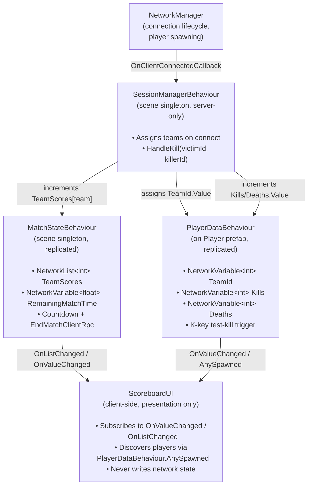

# Week 06 — Team Deathmatch Framework
**Multiplayer Games Development · Unity Track · 9 pts**

**Repository:** https://github.com/0stapyan/mg_week6

## Overview

A fresh Unity 6.3 LTS project (NGO 2.12.0) implementing the framework for a two-team
deathmatch: server-driven match flow, replicated shared state (team scores, match
timer), replicated per-player state (team, kills, deaths), and a scoreboard UI driven
entirely by replicated data and events — no per-frame polling.

Since building a full weapon/projectile system was out of scope for this exercise, a
test-only **K** key (on the locally owned player) simulates a kill against any
currently-known opposing-team player, so the full kill → state-update → UI-update
pipeline can be demonstrated without writing combat code.

## Architecture Diagram

## Class Responsibilities

| Class | Owns | Does NOT own |
|---|---|---|
| `SessionManagerBehaviour` | Match **rules**: team assignment on connect, what happens on a kill | Any replicated data itself; no UI |
| `MatchStateBehaviour` | Replicated **shared** state: team scores, countdown timer, end-of-match broadcast | Deciding *when* a score changes — that's the referee's (SessionManager's) call |
| `PlayerDataBehaviour` | Replicated **per-player** state: team, kills, deaths | Game rules; doesn't decide anything, just holds and replicates |
| `ScoreboardUI` | Rendering replicated state to the screen | Never writes to any `NetworkVariable`; purely reactive to events |

## Why Kill-Handling Lives on `SessionManagerBehaviour`

`HandleKill(victimId, killerId)` is the one piece of logic that needs to touch **two
different replicated-data owners at once** — it updates the victim's and killer's
`PlayerDataBehaviour`, *and* the killer's team's entry in `MatchStateBehaviour.TeamScores`.
Neither `PlayerDataBehaviour` nor `MatchStateBehaviour` should be the one making that
decision: a per-player data class shouldn't need a reference to shared match state (and
vice versa) just to update a score. Putting the decision in a dedicated server-only
"referee" class (`SessionManagerBehaviour`) keeps `PlayerDataBehaviour` and
`MatchStateBehaviour` as pure, dumb data containers — they only ever get told *what*
to set, never decide *why*. This also matches where team assignment already lives
(same class, same responsibility: match-level rules), so all of the "referee" logic is
in one place instead of spread across data classes.

## Test Results (Host + 3 Clients, 4 players total)

- **Team assignment:** confirmed via server log —
  `[SessionManager] Client 0 assigned to team 0`, alternating 0/1/0/1 as each client connects.
- **Shared state replication:** `ScoreText`/`TimeText` update identically across all 4
  windows in real time (confirmed via screenshots during testing).
- **Per-player state:** `PlayersText` correctly lists all connected clients with live
  `TeamId`/`Kills`/`Deaths`, confirmed updating in sync across all windows after
  pressing the test-kill key (**K**).
- **Late joiners:** a client connecting after kills had already been recorded
  immediately saw the correct, non-zero scoreboard state — `PlayerDataBehaviour.AnySpawned`
  plus the initial `SpawnedObjectsList` scan in `ScoreboardUI.Start()` covers this case.
- **End of match:** `RemainingMatchTime` was temporarily reduced to 15s for fast testing;
  confirmed the countdown reaches `00:00` and the server logs
  `[MatchState] Match ended. Score: X - Y. Winner: Team ...` via `EndMatchClientRpc`.
- **4-client demo:** recorded with Host (Editor) + 3 standalone client instances
  (`open -n` on macOS to launch multiple independent copies of the same build).

## One Bug Found and Fixed During Development

`ScoreboardUI` originally subscribed to `MatchStateBehaviour.Instance` inside
`OnEnable()`. Since Unity does not guarantee `Awake()` order **across different
GameObjects**, `MatchStateBehaviour.Awake()` (which sets the singleton `Instance`)
could still be pending when `ScoreboardUI.OnEnable()` ran, silently skipping the
subscription (the null-check meant no exception, just permanently stuck "New Text"
placeholders on the score/timer UI — while the per-player list still worked, since it
depends on a different, event-driven path). Fixed by moving the subscription to
`Start()`, which Unity guarantees runs only after **every** object's `Awake()` in the
scene has completed.

## Known Note for Reviewers

`MatchStateBehaviour.RemainingMatchTime` is currently set to a short value for fast
manual testing/demo purposes rather than a full 5-minute match — see the comment in
`MatchStateBehaviour.cs`.

## Tech Stack
- Unity 6.3 LTS (6000.3.10f1)
- Netcode for GameObjects (NGO) 2.12.0
- TextMeshPro (built-in)
- Platform: macOS Apple Silicon